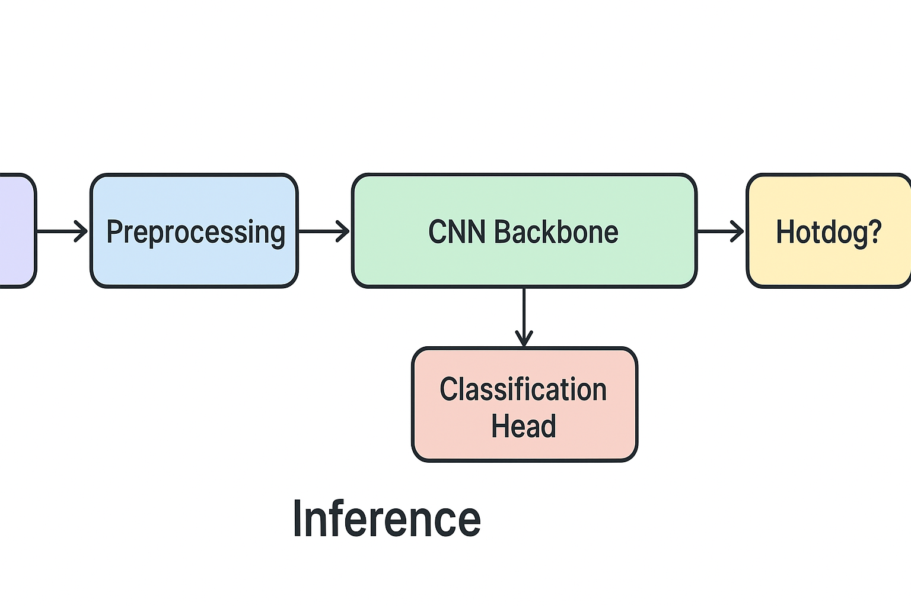

# 🌭 Hotdog Not Hotdog  
> A computer vision project inspired by *Silicon Valley’s* “Not Hotdog” app — using modern deep learning to tell whether your image contains a hotdog or not.

[](https://www.python.org/)  
[](https://pytorch.org/)  

---

## 🧠 Overview
This repository implements a binary image classifier that distinguishes **hotdog** vs. **not hotdog** using transfer learning with pretrained convolutional neural networks (CNNs).  
It’s a lighthearted but powerful exploration of:
- Image preprocessing and augmentation  
- Transfer learning with modern architectures (ResNet, MobileNet, etc.)  
- Model evaluation and performance comparison  
- Building reproducible ML experiments in notebooks and Python scripts  

---

## 🏗️ Architecture



**Pipeline Summary**
1. Image ingestion & preprocessing  
2. Data augmentation (flip, rotation, normalization)  
3. CNN backbone (transfer learning)  
4. Fully connected classification head (binary output)  
5. Evaluation metrics + model export

---

## 📁 Project Structure
```yaml
Hotdog_Not_Hotdog/
│
├── data/ # Datasets (hotdog / not_hotdog images)
├── python_code/ # Supporting Python scripts
├── model.ipynb # Main training + evaluation notebook
├── requirements.txt # Dependencies
├── LICENSE
└── README.md
```

---

## 🧩 Dataset
Images were collected from publicly available subreddits and other online sources.  
They were cleaned and labeled into two categories:
```yaml
data/
├── hotdog/
└── not_hotdog/
```

---

## 🚀 Getting Started

### 1️⃣ Clone the repo
```bash
git clone https://github.com/fonsischeme/Hotdog_Not_Hotdog.git
cd Hotdog_Not_Hotdog
```

### 2️⃣ Install dependencies
```bash
pip install -r requirements.txt
```

### 3️⃣ Run the notebook
```bash
jupyter notebook model.ipynb
```

---

## ⚙️ Modeling Approach

Data Preprocessing

Resize, normalize, and augment images.

Transfer Learning

Fine-tune pretrained CNNs (e.g., ResNet50, EfficientNet).

Evaluation

Measure accuracy, precision, recall, and confusion matrix.

Inference

Export best model for predictions on new images.

---

## 📊 Results

| Model       | Accuracy | Precision | Recall | Notes                                    |
| ----------- | -------- | --------- | ------ | ---------------------------------------- |
| ResNet18    | 0.94     | 0.93      | 0.94   | Fast, great baseline                     |
| MobileNetV3 | 0.96     | 0.95      | 0.96   | Best trade-off between accuracy and size |

🖼️ Example Predictions (to add)
| Input Image                     | Prediction   |
| ------------------------------- | ------------ |
|      | ✅ Hotdog     |
|  | ❌ Not Hotdog |

---

## 🧑‍💻 Contributing

Contributions are welcome!

If you’d like to improve the model, data pipeline, or UI:

1. Fork the repository

2. Create a new branch
```bash
git checkout -b feature/your-feature
```

3. Create a new branch
```bash
git push origin feature/your-feature
```

4. Open a Pull Request describing your improvements.

---

## 🌟 Acknowledgements

Inspired by HBO’s Silicon Valley “Not Hotdog” app.

Built with ❤️ by Alfonso Bonilla